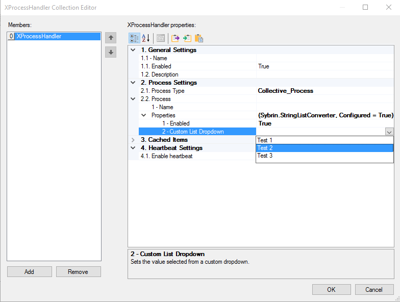

# String List TypeConverter

> This project is used to create a dropdown of strings for the user to select from the PropertyGrid, instead of giving the user free range to type in anything. Similar Typeconverters are DocConverter, DocKeyConverter and ReportConverter that you might be familiar with, to enable the user to select a field of a document from a dropdown.

When this project is done, you will be able to use the converter to create a custom dropdown for your PropertyGrid:



Create a class that inherits from StringConverter:

```cs
public class MyConverter : StringConverter {
        
}
```

This class can already be used as a TypeConverter to change the behaviour of the PropertyGrid. However, it does not know what to populate the list with. In this StringConverter class that you inherited from, you can implement a bunch of methods - these methods determine what your TypeConverter should do.

You dont have to worry about all the methods - the only methods you are converned about are these:

* ```GetStandardValuesSupported```: <br> This method tells the compiler that the converter supports Standard Values (Normal List values)<br><br>
* ```GetStandardValues```: <br> This is where you implement the logic on what the dropdown should contain. You can do a database call to retrieve a list of values, read from a file, or just get the values from code somewhere. When you have the values, you just return the values in a ```StandardvaluesCollection```<br><br>

```cs
public override bool GetStandardValuesSupported(ITypeDescriptorContext context) {
    return true;
}

public override StandardValuesCollection GetStandardValues(ITypeDescriptorContext context) {
    List<string> myList = new List<string>() {
        "Test 1",
        "Test 2",
        "Test 3"
    };

    return new StandardValuesCollection(myList);
}
```