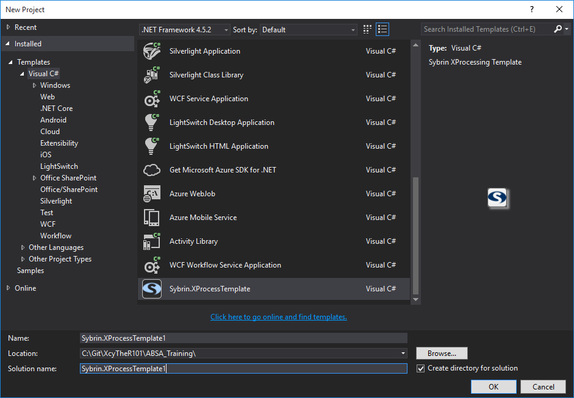
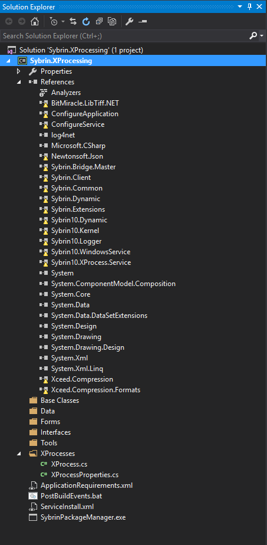
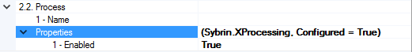
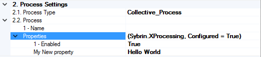

# Add XProcess Template to Visual Studio



## Adding the Template

Place the .zip file in the following location for Visual Studio to recognise the Template:

%APPDATA%/../../Documents/Visual Studio 2015/Templates/ProjectTemplates/

*Visual Studio will automatically recognise the template and allow you to use it for a new project.*

## Using the Template

The template will create the following project layout:



## References
 The following references are neccesary for XProcessing:
 * **BitMiracle.LibTiff.NET**: <br>(Not sure) Used to save the configuration to the Application.saf file<br><br>
 * **ConfigureApplication.exe**: <br>Not needed, the template needs to be updated and this should be removed.<br><br>
 * **ConfigureService**: <br>Not needed as a reference, but added to add the file as an output to the nin directory for testing. This is used to configure the XProcess, and to safe the config to the *Application.saf* file.<br><br>
 * **log4net**:<br> Sybrin10.Kernel's logger is using Log4net as a logging service, and requires this dll to log.<br><br>
 * **Newtonsoft.Json**:<br> Used in storing and reading the configuration in the application.saf file as serialized json.<br><br> 
 * **Sybrin.Bridge.Master**: <br>(Not sure) Acts as a bridge between Visual Basic components and C# components - Required to use XProcesses shared between *Sybrin.Dynamic* and *Sybrin10.Dynamic*. <br><br>
 * **Sybrin.Client**: <br>Core Sybrin Component, required for basic functionality<br><br>
 * **Sybrin.Common**: <br>Core Sybrin Component, required for basic functionality<br><br>
 * **Sybrin.Dynamic**: <br>Host of most of the common XProcesses to be re-used.<br><br>
 * **Sybrin.Extensions**:<br> Contains a lot of extension methods to make coding easier. <br><br>
 * **Sybrin10.Dynamic**:<br> Same as Sybrin.Dynamic, but more focused on Sybrin10. Contains some core XProcesses like Try/Catch, Sequential Flow, etc.<br><br>
 * **Sybrin10.Kernel**:<br> Does most of the heavy lifting for you. Contains property Grid editors, serializing/deserializing functions, Logging, etc.<br><br>
 * **Sybrin10.Logger**: <br>Contains logic to make logging easier<br><br>
 * **Sybrin10.WindowsService.exe**:<br> The executable that will actually fire off the XProcess. Once again, this is not needed as a reference, but it needs to be in the output file, so it's included in the template.<br><br>
 * **Sybrin10.XProcess.Service**:<br> Allows the Configuration Application to add XProcessing as a service to configure. <br><br>
 * **System.Design | System.Drawing | System.Drawing.Design**: <br>These are used to enrich the Property Grid, making it possible to create custom editors, such as Color pickers, custom dropdowns, etc.<br><br>
 * **System.ComponentModel.Composition**:<br> Allows decorative attributes for the propertyGrid, to make the grid more user-friendly<br><br>
 * **Xceed.Compression | Xceed.Compression.Formats**:<br> Used for compressing the serialized configuration to the Applciation.saf file.<br>
 
## Folder Structure

 * **Base Classes**:<br> Its good practise to add base classes to your project, where many classes share the same logic. These classes will then inherit from the base classes in order to inherit the same functionality<br><br>
 * **Data**:<br> All application data models should be stored in here. A data model is a class that contains related data on a specific object. <br><br>
 * **Forms**:<br> If your Process requires any visual forms, it will be stored in this folder.<br><br>
 * **Interfaces**:<br> Its good practise to force certain objects to act a certain way, and interfaces can do just that. When an object inherit from an interface, it is forced to implement its behaviours.<br><br>
 * **Tools**:<br> Any extension tools such as Extension methods, enumerations, any helper classes, can be stored in this folder.<br><br>
 * **XProcessing**:<br> This is where your Xprcess(es) will be stored. Every XProcess has two sides to it, that should be seperated into its own classes:<br>
   * **Configuration**:<br> The configuration contains a class that contains all the **Properties** of your XProcess that should be configured. More on this in the [Configuration](#configuration) section.<br><br>
   * **Execution Logic**:<br> When the XProcess is executed, the Entry point will be the ``execute`` method of this XProcess. More on this in the [Execution](#execution) section. <br><br>

 
# Configuration

Below is a layout of a Configuration class. In a property Grid, the below will be displayed as:




````cs
   public class XProcessProperties : CustomDescriptorBase {

        private bool enabled = true;
        [Category("1 - General"), Description("Sets whether the Properties are enabled or not")]
        [DefaultValue("True")]
        [DisplayName("1 - Enabled")]
        public bool Enabled {
            get { return enabled; }
            set {
                if (enabled != value) {
                    enabled = value;
                }
            }
        }

        public event PropertyChangedEventHandler PropertyChanged;

        public void SetPropertyChanged(string propName) {
            if (PropertyChanged != null)
                PropertyChanged.Invoke(this, new PropertyChangedEventArgs(propName));
        }

        public override string ToString() {
            return string.Format("(Sybrin.XProcessing, Configured = {0})", Enabled);
        }

````

The Property grid retrieves the properties from the XProcess dll that you compiled via the template. The exposed properties of the XProcess is found in the Exectution class (XProcess.cs), we'll get to that in the Execution section. The only important thing to note here is that the properties of the XProcess is instantiated in this file, where the following two properties can be found:

```cs
        private string name = string.Empty;
        [Category("1 - General"), Description("Sets the name of the Service")]
        [DefaultValue("[XProcess]")]
        [DisplayName("1 - Name")]
        public string Name {
            get { return name; }
            set {
                if (name != value) {
                    name = value;
                }
            }
        }

        private XProcessProperties properties = new XProcessProperties();
        [Browsable(true)]
        [TypeConverter(typeof(ExpandableObjectConverter))]
        public override PropertyBase Properties {
            get { return properties; }
            set {
                if (properties != value)
                    properties = (XProcessProperties)value;
            }
        }
```

That explains where the ```Name``` and ```Properties``` properties come from in the above image. In the Properties expander, you see that your configured ```Enabled``` property is displayed. 

The above example exposes only one property, ```Enabled```. When you add more properties to the ```XProcessProperties``` class, you will see them popping up in the configuration.

lets add the following property:

```cs
        private string helloWorldProperty = "Hello World";
        /// <summary>
        /// Gets or sets the Hello World string
        /// </summary>
        [Category("1 - General"), Description("Sets the Hello World string")]
        [DefaultValue("Hello World!")]
        [DisplayName("My New property")]
        public string HelloWorldProperty {
            get { return this.helloWorldProperty; }
            set {
                if (this.helloWorldProperty != value) {
                    this.helloWorldProperty = value;
                }
            }
        }
```

you will see that it is represented like this in the Property Grid:



Here you can set the property's value, and when you change it to something else and save the config, it will be persisted in the Application.saf file.

## Property Decorators
You will see that with every property that you use in a Property Grid, is decorated with C# attributs (Requires ```System.ComponentModel.Composition``` as a reference for these decorators). The only reason for these decorators are to change the behaviour or appearance of these properties in the Grid. For instance, basic attributes include the Display Name, Description, Default Value, and the Category of the property. All of these are visual attributes. 

DisplayName will only change the appearance of the value on the Left-hand side of the property in the Property Grid.
```cs 
[DisplayName("My New property")]
```

The Default Value will not only populate the property with the specified value in the Proeprty Grid, but **Importantly**, use the default value specified for serializing the content to the application.saf file when saving/retrieving the configuration. 

Very important, if you have a property saved in the application.saf file, and you remove that property from your code, and try to load the old config that still contains that property, it *will fail to deserialize* the sazved configuration. *However*, if you have specified a default value, it will simply assign this default value to the property in the old config in the deserialization process.
```cs
[DefaultValue("Hello World!")]
```

Properties can be grouped in categories, which can be expanded in a group. If multiple properties are in the '1 - Genera;' Category, the propertyGrid will attempt to group these properties together
```cs
[Category("1 - General")]
```

The Description will provide a brief description to the user below the Property Grid when the property is selected. It is good practise to always add a description on what the proeprty actually does in order for the user to fully understand what is supposed to go in there. (not what she said.)
```cs
[Description("Sets the Hello World string")]
```

(More Decorators to come)

# Execution

When the XProcess is executed, the entry point is either one of the following methods:

```cs
public override void Execute(IXObject item, ProcessInfo processInfo) {
    execute(item, processInfo);
}

public override void Execute(XObjectList itemList, ProcessInfo processInfo) {
    execute(itemList, processInfo);
}
```

depending on wht is passed to the XProcess as parameters.

XProcesses are meant to be executed in a sequence, each one responsible for one purpose, and to process the data that it received according to what it should do, and pass it on to another process if needed.

Note the first parameter of the method signatures. It can be either a single ```IXObject``` or a collection of ```IXObject```s stored in a collection wrapper, ```XObjectList```

The behaviour of the XProcess should chagne depending on what is passed to the XProcess. This is your own responsibility to check what is passed in, and according to that and what your Process should do, act accordingly.

## Automated Execution
Execution of XProcesses can be changed in the ConfigureService.exe by setting the settings of the Scheduler:
