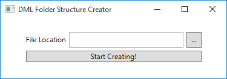

# DML Folder Creator

The DML Creator will create a folder structure for saving files in Sybrin. The fodler structure must be created with a DML level. 

When a DML level of 1 is specified, only one level of folders must be created, for instance:

```
 [Parent Folder]
 ├ 0 
 ├ 1 
 ├ 2 
 ├ 3 
 ├ 4 
 ├ 5 
 ├ 6 
 ├ 7 
 ├ 8 
 └ 9 
 ```

 When a DML level of 2 is specified, two nested levels of folders must be created:

 
``` 
[Parent Folder]
   ├ 0 
   │ ├ 0
   │ ├ 1 
   │ ├ 2
   │ ├ 3
   │ ├ 4
   │ ├ 5
   │ ├ 6
   │ ├ 7
   │ ├ 8
   │ └ 9
   ├ 1
   │ ├ 0
   │ ├ 1 
   │ ├ 2
   │ ├ 3
   │ ├ 4
   │ ├ 5
   │ ├ 6
   │ ├ 7
   │ ├ 8
   │ └ 9
 . . .
```

When a DML of 3 is specified, three nested levels should be created, etc.

## Bonus

Let the XProcess pop up with a window to prompt the user to start the process, with a window similar to the following:

The window should be created in WPF, see the WPF example in the following Repository : [MVVM Repo](https://github.com/XcyTheR101/MVVM)



> When the buttonis pressed, the creation of the folder structure should start off in a background thread. Threads, Tasks or a Background Worker can be used, depending on your choice. <br><br>
> Some sort of loading bar should be displayed to the user to indicate the current progress of the Folder Creation.

### WPF Reading Material:
 * [WPF Tutorial](http://www.wpf-tutorial.com/)
 * [WPF Turorial - Christian Mosers](https://wpftutorial.net/)
 * [WPF - (MVVM Pattern) Code Project Example](https://www.codeproject.com/articles/165368/wpf-mvvm-quick-start-tutorial)